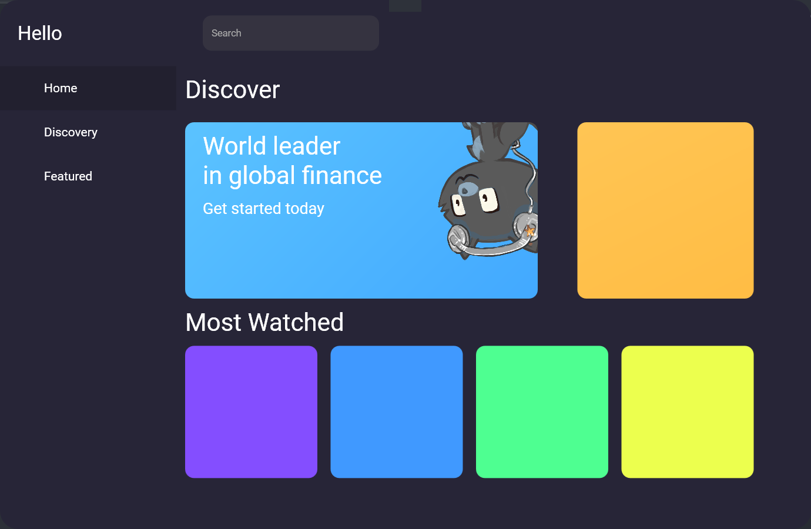

## 개요 

WPF 리소스를 사용한 스타일 적용 연습 코드입니다.

[WPF C# Professional Modern Flat UI Tutorial](https://www.youtube.com/watch?v=PzP8mw7JUzI) 동영상에서 자세한 내용을 확인할 수 있습니다.

프로젝트를 실행하면 아래와 같습니다.

저장소에 포함된 폰트는 구글 폰트 페이지에서 다운로드 받은 파일들입니다.

* [Roboto](https://fonts.google.com/specimen/Roboto)